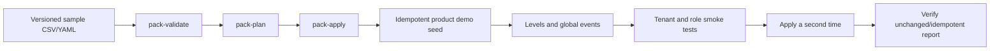

# Local Test Data

Only sanitized data under `institution-packs/school/sample` and
`institution-packs/university/sample` is approved for local and CI seeding.
Do not copy production exports, workbooks, avatars, phone numbers, email
addresses, assessment responses, tokens, or backup contents into the
repository.

For a complete destructive reset, deterministic seed inventory, feature
coverage, and runtime acceptance procedure, use
[Demo reset and reseed](../demo-reset-and-reseed.md).

## Flow



## Steps

1. Install the local site:

   ```bash
   make install
   ```

2. Validate and plan each pack:

   ```bash
   make pack-validate PACK=institution-packs/school/sample
   make pack-plan PACK=institution-packs/school/sample
   make pack-validate PACK=institution-packs/university/sample
   make pack-plan PACK=institution-packs/university/sample
   ```

3. Apply both packs and all product demos:

   ```bash
   make demo-data
   ```

4. Repeat `make demo-data`. Stable entities must be unchanged; mutable demo
   definitions may be updated, but duplicate users, companies, courses,
   products, events, orders, enrolments, points, and block instances are
   failures.

5. Run:

   ```bash
   docker compose exec -T iomad \
     php public/local/institutionpack/cli/tenant_security_audit.php \
     --mode=strict-isolation-check
   ```

For the normal one-command workflow, run:

```bash
make demo-reseed RESEED_ARGS="--yes"
```

Demo passwords are allowed only when
`INSTITUTIONPACK_ALLOW_DEMO_PASSWORDS=true` and
`IOMAD_ENVIRONMENT=local`.
