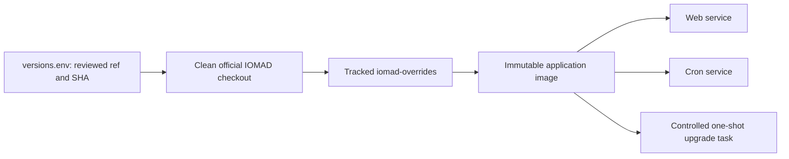
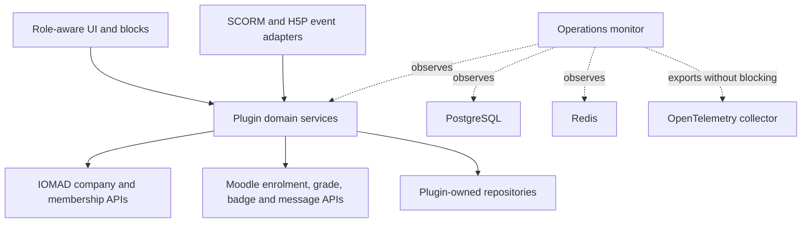

# Component Boundaries

## Source And Customisation Boundary

The ignored `iomad/` directory is a detached checkout of official IOMAD.
Project code is committed under `iomad-overrides/`, copied into an immutable
image after the pinned source is obtained, and tested against that exact
source. Production never runs a floating Git reference.

## Ownership

| Component | Owns | Does not own |
|---|---|---|
| `tool_iomadmonitor` | Service catalogue, health state, error classification, correlation, telemetry export, operational status | Business workflows or tenant content |
| `local_global_events` | Tenant-visible events, XP ledger, levels, badge rules, notification queue, role-safe summaries | Raw SCORM/H5P storage or arbitrary SQL reports |
| `local_iomad_scorm_gen` | Standards-shaped package generation and idempotent learning-progress adapter | Replacing Moodle SCORM tracking |
| `local_iomad_h5p_bridge` | Mapping trusted H5P statement events to idempotent rewards | Accepting untrusted xAPI statements |
| `block_gamification_telemetry` | Accessible learner feedback and progress rendering | Authoritative points calculations |
| Existing page/theme plugins | Role-aware pages, reusable components, design tokens | Tenant authorization decisions |

## Tenant Security Invariants

1. Each institution is an IOMAD company.
2. Authorization resolves company membership through IOMAD APIs, never a
   client-supplied company ID or an ad-hoc `$USER` property.
3. Every plugin-owned repository query includes the company boundary.
4. Course-category ancestry and company-department ancestry remain separate.
5. Site administrator is not granted to tenant roles.
6. Core and IOMAD records are changed through their APIs. Direct database
   writes are limited to plugin-owned XMLDB tables through repository classes.
7. Parent-company reporting is explicit and aggregate by default.

## Runtime Dependency Direction

Observability is fail-open for requests and fail-closed for secrets: an
unavailable collector cannot make the LMS unavailable, while payload
redaction and bounded labels are mandatory before export.

## Integration Boundaries

- WhatsApp and other external channels use signed webhooks, replay protection,
  a durable queue, and disabled-by-default gateways.
- Phone numbers, passwords, tokens, webhook bodies, and learning content are
  not telemetry labels.
- H5P rewards follow `mod_h5pactivity`'s validated
  `statement_received` event.
- SCORM rewards follow core SCORM submission events. Generated packages use
  normal SCORM run-time calls; supplemental XP calls are signed and
  idempotent.
- Workbook macros remain operator-side only. CSV/YAML and immutable manifests
  are canonical.

## Recovery Boundary

A schema migration cannot be reversed with an old container alone. Rollback
after migration restores the previous immutable image, PostgreSQL snapshot,
and dataroot/EFS recovery point as one matching set.
