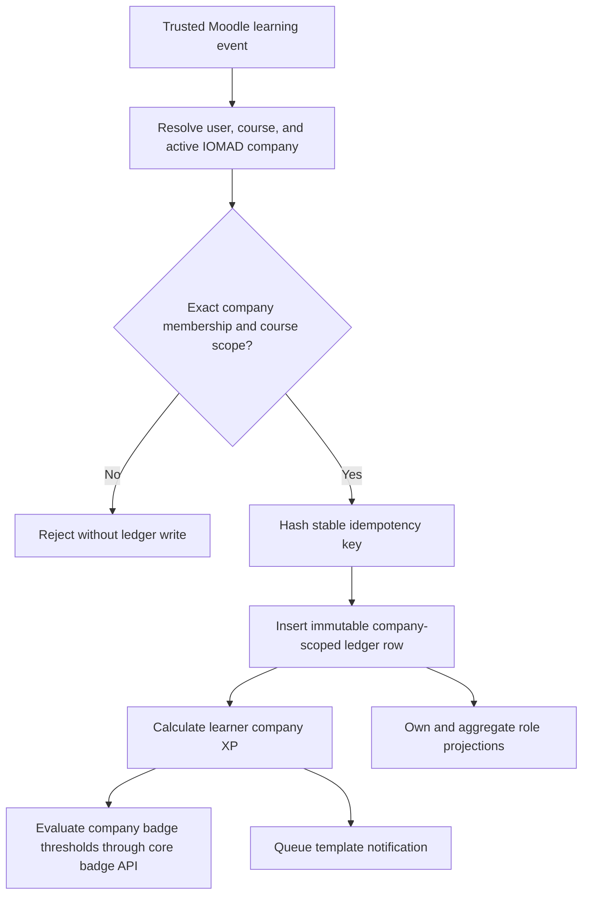
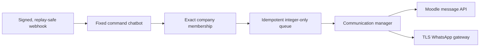

# Gamification And Global Events

## Model

`local_global_events` owns institution-visible events, an immutable XP/grade
ledger, company level thresholds, badge threshold rules, notification jobs,
chat opt-in address hashes, and webhook replay claims.



## Security Invariants

- Every award includes `companyid` and verifies exact active membership.
- A course award verifies the course is assigned or shared to that company.
- Idempotency is company-scoped. Reusing a key with changed points, source,
  user, course, module, type, or metadata hash is rejected.
- Only plugin-owned tables are written directly.
- Badge issuance uses `core_badges\badge`.
- Parent-company dashboards return per-company counts and sums only; they do
  not return learner rows.
- Department managers are not granted the company-level gamification report
  capability by default. HOD/Dean reporting remains in department-aware
  analytics until this ledger has a reviewed department predicate.
- Privacy deletion is the controlled exception to ledger immutability.

## Trusted Reward Sources

| Source | Condition | Default XP | Idempotency |
|---|---|---:|---|
| Quiz | Moodle `attempt_submitted` | 10 | Core event identity |
| Assignment | Moodle `assessable_submitted` | 10 | Core event identity |
| Course | Moodle `course_completed` | 50 | Core event identity |
| H5P | Validated successful `answered` | 5 | Statement event identity |
| H5P | Validated `completed` | 10 | Statement event identity |
| SCORM | Core `completed` status | 20 | User/module/attempt/element/status |
| SCORM | Core `passed` status | 30 | User/module/attempt/element/status |

The defaults are code policy, not tenant-configurable arbitrary expressions.
Changing them requires a reviewed version change and replay tests.

## Events

Events use stable `idnumber`, owner company, optional course, publication
window, and either global or explicit company visibility. Self-enrolment is
available only when a visible event references a company-valid course with an
enabled password-free Moodle self-enrolment instance.

## Dashboard And Communication

The learner page uses
`local_global_events/templates/event_page.mustache` and the
`local_global_events\output\dashboard` view model. It exposes only the current
member's company-scoped progress, recent badges, and available events. The
dashboard block uses the same service and adds a reduced-motion-aware progress
effect; the animation is decorative and never changes achievement state.

Communication is separated into a fixed gateway interface, allowlisted manager,
and command parser:



Supported chat commands are `STATUS`, `MY BADGES`, `MY CODES`, and `HELP`.
`MY CODES` returns a tenant-filtered count from official
`mod_iomadcertificate` issue records and directs the learner to authenticated
IOMAD. Certificate codes, names, addresses, and message content are not copied
into the notification queue or logs.

Outbound provider calls require HTTPS, TLS verification, no redirects, short
connect/total timeouts, bounded responses, request IDs, and valid W3C trace
context. Gateway or telemetry failure does not block core learning.

## Demo Seed

```bash
docker compose exec -T iomad \
  php public/local/global_events/cli/seed_demo.php \
  --company=GV_SCHOOL \
  --course=GV-STD1-MATH-2026
```

Running the command twice updates the same levels and event. It creates no
users and contains no real personal data.
