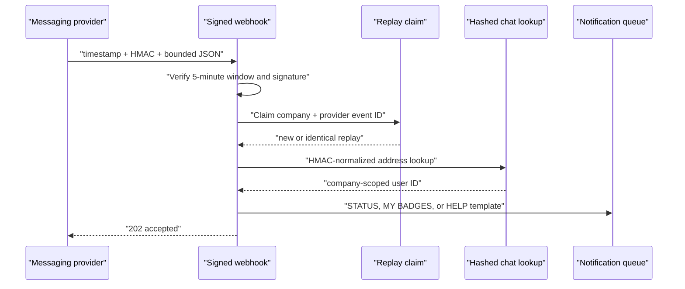

# Notifications And Integrations

## Queue

`local_global_events` stores only recipient user ID, company ID, channel,
allowlisted template key, integer template variables, status, attempts, and a
hashed idempotency key. Email addresses, phone numbers, message bodies,
credentials, and provider responses are not queue payloads.

Moodle messages use the core message API. The optional WhatsApp-compatible
gateway reads the opted-in user's current E.164 address only at delivery time.
It is disabled unless an HTTPS endpoint and runtime token are injected.

## Chatbot Ingress



The address is stored only as an HMAC keyed by
`IOMAD_CHAT_ADDRESS_KEY`. Register an opted-in address from a protected file:

```bash
docker compose exec -T iomad \
  php public/local/global_events/cli/register_chat_address.php \
  --company=GV_SCHOOL \
  --userid=123 \
  --address-file=/run/secrets/chat_address
```

Do not pass the address directly on the command line.

## Runtime Secrets

- `IOMAD_WHATSAPP_GATEWAY_URL`
- `IOMAD_WHATSAPP_GATEWAY_TOKEN`
- `IOMAD_WHATSAPP_WEBHOOK_SECRET`
- `IOMAD_CHAT_ADDRESS_KEY`

Use Secrets Manager or an equivalent runtime secret source. Rotate gateway and
webhook secrets independently. A webhook secret change does not require
re-hashing opted-in addresses; an address-key change requires a controlled
re-registration process.
