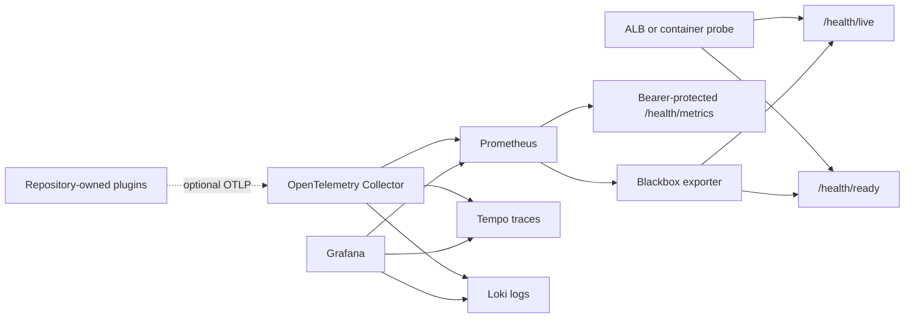

# Health And Observability

## Contracts

| Endpoint | Dependency depth | Success | Failure | Exposure |
|---|---|---:|---:|---|
| `/health` | Nginx process | 200 | Connection failure | Public, legacy container probe |
| `/health/live` | Nginx process | 200 | Connection failure | Public |
| `/health/ready` | Database, Redis, dataroot, runtime security | 200 | 503 | Public, aggregate only |
| `/health/startup` | Source pin, service graph, database | 200 | 503 | Public, aggregate only |
| `/health/metrics` | Full aggregate monitor | 200 | 404/503 | Bearer token required |
| `/admin/tool/iomadmonitor/status.php` | Service catalogue | 200 | Moodle error | Authenticated capability |

Public health responses contain only the contract, aggregate state, and request
ID. Detailed checks and the dependency catalogue require
`tool/iomadmonitor:view`. Metrics labels are allowlisted check IDs; company,
user, hostname, email, course name, content, token, and exception message are
not labels.



## Service Registry

`tool_iomadmonitor` owns a validated directed acyclic graph. Every descriptor
has a stable ID, component, description, owners, type, criticality,
dependencies, visibility, endpoints, dashboard, runbook, capability, company
scope, data classification, timeout, retry policy, scheduled task, health
check, and bounded tags. Registration rejects duplicates, missing
dependencies, self-dependencies, cycles, and invalid metadata. See the
[service catalogue](service-catalogue.md) and
[endpoint catalogue](endpoint-catalogue.md).

## Exceptions And Correlation

Repository-owned entry points use:

- validated or generated `X-Request-ID`;
- stable exception categories and HTTP status mappings;
- RFC 9457-shaped public problem details without exception messages;
- recursive redaction of credentials, session keys, webhook data, email,
  mobile, content, and response bodies;
- bounded log context.

Rewards and telemetry are fail-open for learning workflows. Security checks,
signature verification, and tenant authorization are fail-closed.
See the [exception catalogue](exception-catalogue.md),
[telemetry dictionary](telemetry-data-dictionary.md), and
[failure-mode matrix](failure-mode-matrix.md).

## Optional Local Stack

Generate runtime credentials and start the pinned profile:

```bash
make observability-validate
make observability-up
```

Local endpoints:

| Service | URL |
|---|---|
| Grafana | `http://localhost:13000` |
| Prometheus | `http://localhost:19090` |
| Alertmanager | `http://localhost:19093` |
| Loki | `http://localhost:13100` |
| Tempo | `http://localhost:13200` |

The Grafana password and metrics bearer token are generated under ignored
`.runtime-secrets/`. Do not print, commit, or copy them into `.env`.
Grafana provisions the read-only `IOMAD Platform Overview` dashboard from the
repository. The [SLO, alert, and dashboard catalogue](slo-alert-dashboard-catalogue.md)
records each panel and alert contract.

Stop the optional stack with:

```bash
make observability-down
```

Removing the observability Compose overlay must not change IOMAD readiness or
learning behavior.

## Cardinality And Privacy

Allowed dimensions are bounded service, route template, health check, status
class, deployment environment, and release. Raw URL, query string, tenant
hostname, company ID, user ID, course ID, exception message, prompt, form
content, and chat address are prohibited.

Telemetry retention is a deployment policy. The local defaults are 15 days for
Prometheus and seven days for Loki/Tempo. Production retention, legal hold,
access control, and deletion must be approved before deployment.
