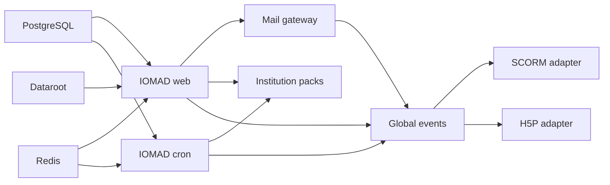

# Service Catalogue

## Contract

The executable catalogue is
[`service_catalogue.php`](../../iomad-overrides/public/admin/tool/iomadmonitor/classes/local/service_catalogue.php).
`tool_iomadmonitor` rejects duplicate IDs, self or missing dependencies, cycles,
unknown metadata, invalid capabilities, unbounded tags, and unsupported
visibility or tenant scopes.

Every record contains ID, component, description, technical and business owner,
type, criticality, dependencies, visibility, public/internal endpoints,
dashboard, runbook, required capability, company scope, data classification,
timeout, retry policy, scheduled task, health check, and tags. The protected
JSON representation is available at:

```text
/admin/tool/iomadmonitor/status.php?output=json
```

It requires `tool/iomadmonitor:view` and returns no credentials, personal data,
tenant names, exception text, or integration payloads.

## Registered Services

| ID | Type | Criticality | Depends on | Scope | Health |
|---|---|---|---|---|---|
| `platform.database` | storage | critical | none | system | `database` |
| `platform.redis` | storage | critical | none | system | `redis` |
| `platform.storage` | storage | critical | none | system | `storage` |
| `platform.web` | runtime | critical | database, Redis, storage | system | `security` |
| `platform.cron` | runtime | critical | database, Redis | system | `cron` |
| `platform.mail` | integration | important | web | system | queue aggregate |
| `application.institution-pack` | application | important | web, cron | current company | `integrations` |
| `application.commerce` | application | optional | web, cron, mail | current company | `integrations` |
| `application.connector` | application | optional | web, cron | current company | `integrations` |
| `application.global-events` | application | important | web, cron, mail | current company | `integrations` |
| `application.scorm-adapter` | application | optional | web, global events | current company | parent service |
| `application.h5p-adapter` | application | optional | web, global events | current company | parent service |

Optional application services are registered only when their component exists.
Production ownership is `platform-engineering` and `lms-operations`; repository
CODEOWNERS must be replaced with real GitHub teams before branch protection is
enabled.



## Visibility

- `public`: aggregate health contract only.
- `authenticated`: authenticated user and any explicit company boundary.
- `operator`: authenticated plus the descriptor capability.
- `internal`: never returned by the presentation policy.

Current records are operator-only. Public probes are deliberately separate
from the detailed catalogue.

