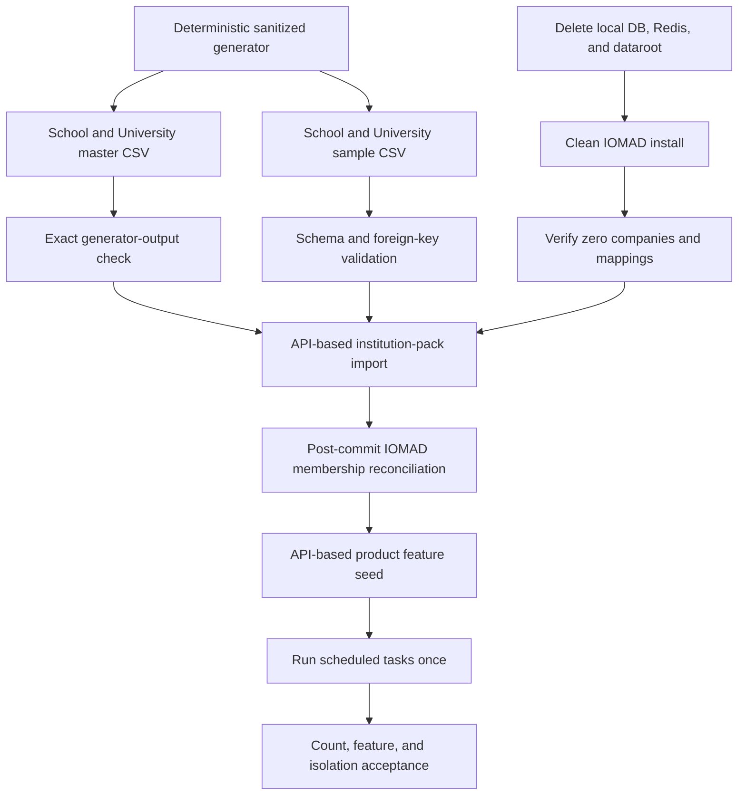

# Demo Reset and Reseed

This runbook resets only the local Docker Compose IOMAD installation. It then
optionally installs the repository's sanitized School and University
demonstration tenants.

The reset is destructive. It removes the local PostgreSQL and Redis volumes and
the local `iomaddata/` directory. It does not remove the pinned `iomad/`
checkout, tracked overrides, canonical institution packs, `.env`, or recovery
sets under `backups/`.

## Resulting States

### Clean IOMAD defaults

For a complete interactive local reset, verified backup, image rebuild, and
fresh Moodle/IOMAD database installation:

```bash
make reset-local RESET_ARGS="--backup --build"
```

The command requires the exact confirmation phrase `RESET LOCAL IOMAD`. For an
explicitly approved unattended local reset, add `--yes`:

```bash
make demo-clear RESET_ARGS="--yes --backup --build"
```

`make demo-clear` performs a clean IOMAD installation and runs
`local_institutionpack/cli/verify_clean.php`. The command fails unless all of
the following are zero:

- IOMAD companies
- company-user mappings
- company-course mappings
- company departments

The Moodle site, administrator, standard roles, standard plugins, and project
plugins remain installed. No School or University data exists in this state.
The reset removes the complete local PostgreSQL and Redis volumes plus
`iomaddata/`; it preserves `.env`, source, overrides, institution packs, and
verified recovery sets under `backups/`. Never run it in stage or production.

### School and University demonstration state

```bash
make demo-reseed RESEED_ARGS="--yes"
```

This is the normal full rebuild. It:

1. Regenerates deterministic CSV master and sample packs.
2. Checks that tracked CSVs exactly match generator output.
3. Validates both pack file sets.
4. Deletes the local database, cache, and dataroot.
5. installs a clean IOMAD database.
6. proves that the clean installation has zero companies.
7. imports the School and University packs through Moodle and IOMAD APIs.
8. reconciles company memberships through the supported IOMAD company API
   after deferred `user_created` observers have completed.
9. seeds project feature demonstrations through their supported APIs.
10. runs cron once.
11. verifies counts, feature records, native manager types, feature
    relationships, and strict tenant isolation.

To create a verified recovery set before the reset:

```bash
make demo-reseed RESEED_ARGS="--yes --backup"
```

To reuse an already built image:

```bash
make demo-reseed RESEED_ARGS="--yes --no-build"
```

`--no-build` must not be used after changing code in `iomad-overrides/`.

The demo import disables IOMAD's `local_iomad/autoenrol_managers` setting.
This keeps teacher and faculty records classified as company educators while
their explicit `editingteacher` enrolments remain limited to the courses
declared by the packs. Principal, registrar, trustee, HOD and dean permissions
continue to come from scoped company or department role assignments.

The import script also quiesces the Compose cron service for the bounded bulk
operation and restores it through an exit trap. IOMAD dispatches
`user_created` observers only after the delegated import transaction commits.
The importer therefore snapshots the desired company department, manager
type, and educator state, then performs a post-commit upsert and read-back
through `local_iomad\company`. This prevents the upstream sign-up observer
from resetting a newly imported principal, trustee, HOD, or dean to a normal
company user on the first import. The import report records the reconciled
membership count without logging personal data.

## Seed Inventory

The canonical generator is `scripts/generate-demo-packs.py`. Both `master/` and
`sample/` are generated from the same sanitized definitions. Run:

```bash
make demo-generate
make demo-check
```

The seeded installation contains exactly two IOMAD companies:

| Company | Shortname | Local hostname | Learners | Parent or mentor links | Courses | Enrolments |
|---|---|---|---:|---:|---:|---:|
| Demo School | `GV_SCHOOL` | `school.localhost` | 100 | 100 | 37 pack courses | 437 pack enrolments |
| Demo University | `NBU_ENGINEERING` | `university.localhost` | 100 | 100 | 33 pack courses | 533 pack enrolments |

The School pack also includes 219 company users, 11 declared departments, 52
course categories, 12 cohorts, 37 groups, 4 policies, and 6 license records.
The University pack includes 174 company users, 10 declared departments, 54
course categories, 8 cohorts, 33 groups, 4 policies, and 8 license records.
IOMAD may create its required root department in addition to declared pack
departments.

School categories demonstrate academic year, board, medium, standard, stream,
and subject organization. University categories demonstrate academic year,
faculty, programme, semester, and course organization. Company departments
remain separate from those course-category trees.

All identities and content are synthetic. Email addresses use reserved local
domains. Password columns are blank; the local-only password comes from the
ignored `.env` configuration and is never printed by reset or seed scripts.

## Feature Coverage

After pack import, `scripts/seed-product-demos.sh` creates visible,
tenant-scoped examples for both companies:

| Area | Demonstration data |
|---|---|
| IOMAD administration | company, hostname, departments, users, roles, courses, cohorts, groups, policies, licenses, and branding |
| Course delivery | subject courses, orientation course, video-format course, learner enrolments, and progress-ready structures |
| Page builder | one published tenant homepage using the School or University starter template |
| AI course creator | one approved and published deterministic draft course with generated activities |
| Dashboard | page-builder, role-aware dashboard, and gamification blocks on the front page |
| Rapid grading | one orientation grade item and 100 final learner grades per company |
| Gamification | 100 XP ledger entries, levels, one badge definition, and 100 badge awards per company |
| Engagement | 100 course-view events and 100 learner to-do items per company |
| Global events | at least four published events per company |
| Notifications | five idempotent Moodle message queue records per company |
| Commerce | free and paid products plus local demonstration orders and enrolment assignment |
| Forms | one tenant form and one sanitized submission per company |
| Relationships | 100 explicit School guardian links and 100 University mentor links |

Inspect the companies and their features from:

- IOMAD: `http://localhost:18080`
- School tenant: `http://school.localhost`
- University tenant: `http://university.localhost`
- Mailpit: `http://localhost:18025`

The administrator username and password are read from the local `.env`.
Tenant demo credentials are also controlled by local environment settings.

## Verification

Run the full runtime acceptance check at any time:

```bash
make demo-verify
```

The verifier returns JSON without names, email addresses, passwords, or
tokens. It checks:

- exactly two expected companies and no additional company
- exactly 100 learners and 100 relationship links per company
- minimum users, courses, departments, categories, cohorts, groups,
  enrolments, policies, and licenses
- video courses and 100 orientation enrolments per company
- 100 grades, 100 badge awards, 100 XP rows, 100 view logs, and 100 tasks per
  company
- page builder, AI course, dashboard, commerce, forms, global events, and
  notifications
- strict company course, user, role, and enrollment isolation

Validate import idempotency by applying the same canonical data a second time:

```bash
make demo-data
make demo-verify
```

Stable companies, users, courses, products, orders, events, points, tasks,
grades, and block instances must not duplicate.

## Data Flow



## Safe Maintenance

Do not edit generated sample CSVs by hand. Change
`scripts/generate-demo-packs.py`, regenerate both packs, review the diff, and
run repository validation.

```bash
make demo-generate
make demo-check
make test
```

Do not use this reset procedure for stage or production. Production recovery
must use the matching immutable image, PostgreSQL backup, and dataroot recovery
set described in `docs/backup-restore.md`.

External AI providers, payment gateways, OIDC identity providers, WordPress,
WooCommerce, WhatsApp, SMS, and commercial reporting products require
separately supplied credentials or licensed artifacts. Their configuration
surfaces remain disabled or use local test adapters in the demo environment;
the reseed process never invents credentials or sends external traffic.
