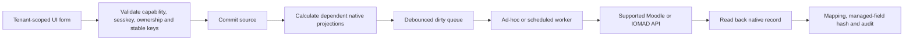

# Tenant Master

`local_tenantmaster` replaces the school master workbook and macro workflow with
a tenant-scoped IOMAD administration application. Normal operators do not need
a Tenant Master CLI or an institution-pack CLI.

Site administrators can configure reusable academic defaults before creating a
company in **Site administration > Tenant Master > Master catalogue**. Create
and administer each company in native IOMAD, then open **Managed institutions**
and initialise academic management for that existing company.

1. **Master catalogue** for system-level Shared, School, University, College
   and Training templates with safe background propagation.
2. **Dashboard** to open grouped native and academic operations, review live
   counts, adopt defaults, validate, or enqueue Sync All.
3. **Institution master data** for institution type and regulatory or academic
   identifiers that have no native IOMAD company field.
4. **Academic masters** for academic years, boards, mediums, grades,
   programmes, semesters, streams, subjects, templates, and policies.
5. **Organisation**, **Users and roles**, and **Cohorts and enrolments** to
   review live native records and open capability-filtered IOMAD operations.
6. **Academic course projections** to filter assigned courses, open native
   editing, and inspect category, course and custom-field mappings.
7. **Assessments** and **Certificates** for policy CRUD, package import and
   supported native application.
8. **Classes and placements** to reconcile a school learner's native cohort,
   group and subject-course access.
9. **Progression** for policy status, reviewed decisions and guarded rollover.
10. **Imports** for ZIP upload, inspection, plan, approval, apply, resume, and
   report.
11. **Synchronization**, **Validation**, and **Audit** for operations and
    evidence.

Companies, departments, users, memberships, managers, ordinary courses,
cohorts, groups, enrolments, licences, domains and branding are manually
managed only in IOMAD. Tenant Master pages provide contextual links to those
native screens.

School operators should follow
[School management in Tenant Master](school-management.md) for the complete
menu sequence, native mapping, class placement, course-copy and annual
progression workflow.

All forms use the default IOMAD/Moodle renderer, navigation, tables,
breadcrumbs, sesskeys, capabilities, and responsive theme behavior. Populated
tables provide local row filtering and sortable data columns; native edit
actions continue to open supported IOMAD or Moodle administration screens. The
plugin does not install a theme.

## Automatic Processing

A validated create or edit commits its source record, calculates affected
dependencies, marks work dirty, and queues a Moodle ad-hoc task. A scheduled
recovery worker runs every minute. The web request does not perform a large
rebuild.

`Sync All` is a recovery/reconciliation action, not a required step after each
edit. Automatic synchronization is enabled by default. When paused in plugin
settings, dirty work remains visible and is not discarded.

## Native Data Rule

- Company, department, user, membership, role assignment, category, course,
  company-course assignment, cohort, group, enrolment, gradebook, completion,
  and certificate records are real IOMAD/Moodle records.
- The plugin stores only definitions without a complete native equivalent:
  academic master semantics, policy expressions, versioned defaults, import
  manifests, mapping hashes, queue state, validation, drift, rollover plans,
  and audit evidence.
- The plugin never duplicates a full native user profile and never stores a
  user password.
- Project code calls supported APIs. It does not write native tables directly.

## Safety

- A trust and its institution are one tenant business record linked one-to-one
  to an IOMAD company by stable `trust_code`.
- Child companies are used only for independently administered tenants.
  Campuses, faculties, and organisational units normally use departments.
- IOMAD departments and Moodle course categories are separate hierarchies.
- No workflow grants site administrator to a tenant role.
- There is no automatic deletion of companies, users, active courses,
  enrolments, grades, submissions, completion, certificates, or history.
- Destructive rollover reconciliation requires system-level capability,
  preview, confirmation, and a recovery-set reference.

## Documentation

- [Architecture and ownership](architecture.md)
- [Native-first administration](native-first-administration.md)
- [Master catalogue](master-catalogue.md)
- [Control surface and Admin Tools](control-surface.md)
- [DPS school use case](dps-school-use-case.md)
- [Workbook migration](workbook-migration.md)
- [Data model](data-model.md)
- [Academic model](academic-model.md)
- [School management](school-management.md)
- [Roles and capabilities](roles-capabilities.md)
- [Synchronization and drift](synchronization.md)
- [Import packages](import-packages.md)
- [Operations and recovery](operations.md)
- [Ecosystem verification](ecosystem-verification.md)
- [Developer API map](developer.md)
- [Testing and acceptance](testing-acceptance.md)
- [CRUD and integration validation](crud-validation.md)

Platform installation, cron, upgrade, backup, and restore still use the normal
repository automation documented outside this section. That infrastructure
automation is not a prerequisite for everyday Tenant Master administration.
