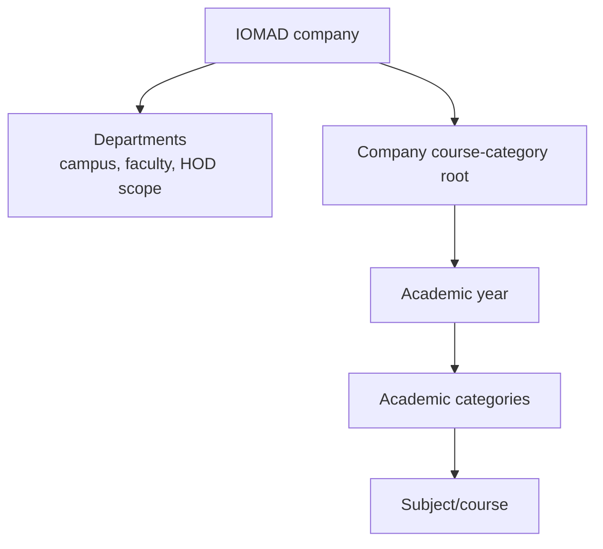

# Academic Model

## Separate Hierarchies

IOMAD departments describe management scope. Moodle categories describe
academic course organisation. They are never inferred from one another.

## School Catalogue

Default school definitions include:

- CBSE, CISCE, State, and IB boards;
- English, Hindi, and Gujarati mediums;
- Nursery, LKG, UKG, and Standards 1-12;
- Science, Commerce, and Humanities streams;
- four divisions;
- 18 common school subjects;
- assessment, attendance, certificate, and progression policies.

Typical category composition is:

`Academic year > board > medium > grade > stream/division`

The UI permits a tenant to choose the exact parent relationships. Subjects are
real Moodle courses and can be placed under the applicable mapped category.

## University/College Catalogue

Defaults include:

- five faculties;
- BSc Computer Science, BTech CSE, BCom, BA, and MBA programmes;
- Semesters 1-8;
- common university subjects;
- 1, 2, 3, 4, and 6-credit definitions;
- shared assessment, attendance, certificate, and progression policies.

Typical composition is:

`Academic year > faculty > programme > semester > subject course`

Faculties and programmes are academic categories even when an organisational
faculty department also exists; the records serve different scopes.

## Native Learning Configuration

- A subject or course template becomes a native Moodle course and is assigned
  to the selected IOMAD company.
- `TM_ASSESSMENT` is a native grade category.
- `TM_ATTENDANCE` is a native grade item with the tenant policy pass threshold.
- Course completion is enabled and the course grade pass value is configured.
- One native `mod_iomadcertificate` activity is maintained for each company
  course when a certificate rule is active.

The pinned official IOMAD 5.1 source does not include `mod_attendance`.
Tenant Master therefore represents attendance through the supported Moodle
gradebook without introducing a breakable third-party plugin.

## Academic History And Rollover

Grades, submissions, completion, certificates, and logs remain native history.
Rollover never copies or rewrites historical outcomes.

1. Create the next academic year.
2. Preview a rollover plan.
3. Review each copied year-scoped definition.
4. Take and verify a matching database/dataroot backup.
5. Apply with system-level destructive capability and the recovery-set
   reference.
6. Automatic synchronization creates target-year native records.
7. Validate before changing current-year status or enrolments.

Promotion and alumni decisions are policy-driven operator actions based on
native grade/completion evidence. They do not silently delete or rewrite a
learner’s prior-year access or history.
