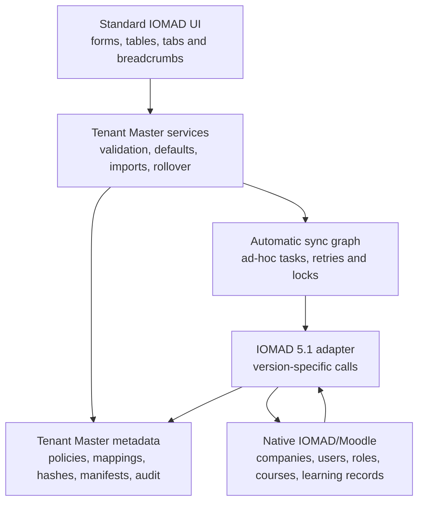
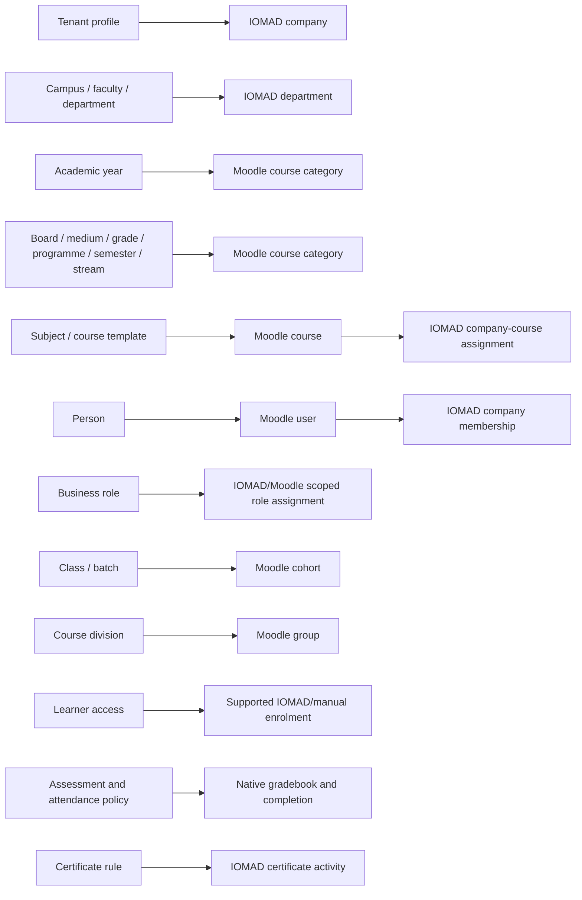

# Tenant Master Architecture

## Boundary

`local_tenantmaster` is an orchestration and master-definition plugin. IOMAD and
Moodle remain the system of record for all executable platform objects.

## Ownership

| Domain | Authority | Tenant Master responsibility |
|---|---|---|
| Tenant | IOMAD company | Stable trust mapping and type-specific profile |
| Organisation | IOMAD departments | Validate scope and call department APIs |
| People | Moodle user + IOMAD membership | Create native user, assign company, never store profile copy |
| Roles | Moodle/IOMAD roles | Map business roles to native role/scope |
| Academic hierarchy | Moodle course categories | Store academic semantics and project categories |
| Subjects/templates | Moodle courses | Store reusable definition and project/assign native course |
| Learning access | Cohorts, groups, enrolments | Validate same-company references and call supported APIs |
| Results/history | Grades and completion | Read native records; do not duplicate history |
| Attendance | Native grade item | Project `TM_ATTENDANCE`; no unsupported attendance plugin |
| Certificates | `mod_iomadcertificate` | Project one managed activity per company course |
| Policy semantics | Tenant Master | Store versioned expressions because no complete native equivalent exists |
| Operations | Tenant Master metadata | Queue, jobs, mappings, validation, drift, import and audit |

## Projection Targets

## Dependency Order

1. Company and combined tenant identity.
2. Current academic year and company category root.
3. Departments and parent departments.
4. Academic category parents.
5. Native categories.
6. Native courses and company-course assignment.
7. Native users and company membership.
8. Scoped role assignments.
9. Cohorts and groups.
10. Memberships and enrolments.
11. Gradebook, attendance, completion, and certificates.
12. Validation, read-back hashes, drift, and audit.

The queue is idempotent and uses stable external IDs. A failure does not advance
the item to synced and does not duplicate a successful native record on retry.

## Version Boundary

All release-specific calls live behind
`local_tenantmaster\local\projection_adapter`. The current implementation is
`iomad_501_adapter` and is reviewed against IOMAD commit
`55b3128b8058d27f6cc4320850ca709ed5a792a9`. Future IOMAD upgrades must update
the adapter and compatibility tests before deployment.
