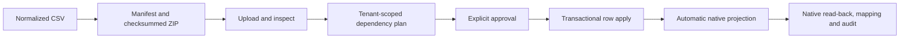

# Tenant Master Control Surface

Tenant Master is the company-scoped operator entry point. It does not replace
authoritative IOMAD or Moodle records. Each screen identifies its ownership:

- **Native platform data** means the current record is read from IOMAD or
  Moodle and changes open the supported native administration route.
- **Tenant Master data** means no complete native academic model exists; CRUD,
  bulk import, automatic synchronization, mapping, drift and audit are owned by
  `local_tenantmaster`.

## Navigation

Select the active company in **IOMAD Admin Tools**, then open the dedicated
**Tenants** top-level tab. The tab inherits IOMAD's selected company and shows
only operations permitted in that company context. An uninitialised company
shows onboarding tiles only. An initialised company shows its institution
profile, organisation, academic domains and operating tools in sequence.

School tenants receive separate **Academic years**, **Board**, **Medium**,
**Grade**, **Stream**, **Division** and **Subject** tiles. University and
college tenants receive **Programme**, **Semester**, **Specialisation**,
**Credit** and **Subject** instead. Each domain opens its own filtered CRUD
table and preserves the company ID in every link. The **Tenant workspace** tile
provides the same sequence with live counts and workflow descriptions.

| Screen | Data and actions |
|---|---|
| Global master templates | Optional, site-administrator-only Shared/School/University/College/Training defaults, versioning, activation, guarded reversible removal, restoration and safe tenant propagation |
| Tenant workspace | Numbered native, tenant-master and assurance tiles, live counts and default adoption |
| Managed institutions | Initialise an existing coded IOMAD company; never create a duplicate tenant company |
| Institution master data | Read native company identity and edit only regulatory or academic extension metadata |
| Organisation | Read current native department hierarchy, parent, user count and course count; open IOMAD department management |
| Tenant master data | Tenant-owned CRUD and bulk package import for years, boards, media, grades, streams, divisions, subjects, programmes, semesters, credits, templates and policies |
| Academic course projections | Filter all assigned native courses, open course editing and IOMAD course settings, inspect category/course mappings and native custom fields |
| Users and roles | Filter live company memberships, manager/educator scope and suspension; open native user, manager and additional-field management |
| Cohorts and enrolments | Read Tenant Master-managed cohorts and all company-course groups and enrolment instances |
| Assessments | CRUD/import assessment and attendance policy masters, then apply through the native gradebook configuration service |
| Certificates | CRUD/import certificate rules and project through the installed IOMAD certificate API |
| Classes and placements | School-only learner placement projected to native cohorts, groups and cohort-sync enrolments |
| Progression | Reviewed promotion/repeat/transfer/withdrawal/graduation and guarded annual rollover |
| Imports | Inspect, checksum, dependency-plan, approve, apply and resume versioned ZIP/CSV packages |
| Synchronization | Sync All, per-master and per-type retry, job state and drift resolution |
| Validation and Audit | Tenant isolation, ownership, dependency findings and non-sensitive change evidence |

All screens preserve the selected company. Every tenant-master-data page names
the owning institution. Site administrators receive an explicit company
selector; tenant roles remain restricted to their resolved IOMAD company
context. Identical codes may exist in separate tenants because ownership and
uniqueness are enforced inside the tenant boundary.

Populated data tables include a local row filter, sortable non-action columns
and 20-row pagination when required. Filtering resets to page one; sorting
reorders the full tenant-scoped result before repagination. These controls
affect only records already returned by the tenant-scoped server query.
Course and user searches remain server-side and cannot broaden the selected
company scope.

## Bulk And CRUD

Academic master screens expose both normal CRUD and **Bulk import**. Bulk
operations use the versioned package pipeline rather than accepting an
unreviewed spreadsheet:

Native company, user and course bulk operations remain in IOMAD. Tenant Master
places those links beside the live read model so operators do not need to
guess which system owns a field.

## Course Editing

The **Tenant course editor** Admin Tools tile opens the selected company's
course inventory. Operators can search by course name, shortname, idnumber,
category, department or managed external key and filter visible/hidden
courses. **Edit** opens Moodle's supported course form. **IOMAD settings** opens
the company-specific auto-enrol, mandatory, validity and notification
settings. Tenant Master never writes those settings directly.

## Additional Fields

Company user profile fields remain native IOMAD definitions. The **Users and
roles** screen lists the fields enabled for the selected company and opens
IOMAD's profile-field selector. Enabled fields appear in the native company
user create/edit form's additional profile section.

Tenant Master course identity is projected into locked Moodle course custom
fields through `core_customfield` APIs. The course screen lists the current
definitions and creates them only when the first managed course is projected.

## Admin Tools

The pinned IOMAD Admin Tools block has a reviewed, SHA-guarded extension for
plugin-defined top-level tabs. Tenant Master uses that extension to add
**Tenants** after the native Reports tab. It does not change or duplicate the
native Companies, Users, Courses, Licenses, Competencies, E-Commerce,
Microlearning or Reports panes.

The Tenants pane is built after capability checks and from the active company:

- no Tenant Master profile: **Tenant workspace** and **Managed institutions**;
- school: school academic-domain tiles plus learning and assurance operations;
- university or college: higher-education domains plus the same applicable
  operations;
- training organisation: programme, subject and credit domains plus applicable
  operations.

**Global master templates** is intentionally available only under **Site
administration > Tenant Master**. It is an optional source of reusable
defaults, not a tenant editing surface.

The theme groups Admin Tools into **Native IOMAD tools** and **IOMAD Learning
tools** using link destinations after IOMAD has performed its normal
capability filtering. It does not add access to a hidden tool or modify the
upstream menu template.
