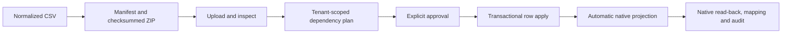

# Tenant Master Control Surface

Tenant Master is the company-scoped operator entry point. It does not replace
authoritative IOMAD or Moodle records. Each screen identifies its ownership:

- **Native platform data** means the current record is read from IOMAD or
  Moodle and changes open the supported native administration route.
- **Tenant Master data** means no complete native academic model exists; CRUD,
  bulk import, automatic synchronization, mapping, drift and audit are owned by
  `local_tenantmaster`.

## Navigation

| Screen | Data and actions |
|---|---|
| Master catalogue | Pre-company Shared/School/University/College/Training CRUD, versioning, activation and safe tenant propagation |
| Dashboard | Native and academic tool groups, live counts, Sync All, validation and default adoption |
| Managed institutions | Initialise an existing coded IOMAD company; never create a duplicate tenant company |
| Institution master data | Read native company identity and edit only regulatory or academic extension metadata |
| Organisation | Read current native department hierarchy, parent, user count and course count; open IOMAD department management |
| Academic structure | CRUD and bulk package import for years, boards, media, grades, streams, divisions, subjects, programmes, semesters, credits, templates and policies |
| Academic course projections | Filter all assigned native courses, open course editing and IOMAD course settings, inspect category/course mappings and native custom fields |
| Users and roles | Filter live company memberships, manager/educator scope and suspension; open native user, manager and additional-field management |
| Cohorts and enrolments | Read Tenant Master-managed cohorts and all company-course groups and enrolment instances |
| Assessments | CRUD/import assessment and attendance policy masters, then apply through the native gradebook configuration service |
| Certificates | CRUD/import certificate rules and project through the installed IOMAD certificate API |
| Classes and placements | School-only learner placement projected to native cohorts, groups and cohort-sync enrolments |
| Progression | Reviewed promotion/repeat/transfer/withdrawal/graduation and guarded annual rollover |
| Imports | Inspect, checksum, dependency-plan, approve, apply and resume versioned ZIP/CSV packages |
| Synchronization | Sync All, per-master and per-type retry, job state and drift resolution |
| Validation and Audit | Tenant isolation, ownership, dependency findings and non-sensitive change evidence |

All screens preserve the selected company. Site administrators receive an
explicit company selector; tenant roles remain restricted to their resolved
IOMAD company context.

Populated data tables include a local row filter and sortable non-action
columns. These controls affect only records already returned by the
tenant-scoped server query. Course and user searches remain server-side and
cannot broaden the selected company scope.

## Bulk And CRUD

Academic master screens expose both normal CRUD and **Bulk import**. Bulk
operations use the versioned package pipeline rather than accepting an
unreviewed spreadsheet:

Native company, user and course bulk operations remain in IOMAD. Tenant Master
places those links beside the live read model so operators do not need to
guess which system owns a field.

## Course Editing

The **Tenant course editor** Admin Tools tile opens the selected company's
course inventory. Operators can search by course name, shortname, idnumber,
category, department or managed external key and filter visible/hidden
courses. **Edit** opens Moodle's supported course form. **IOMAD settings** opens
the company-specific auto-enrol, mandatory, validity and notification
settings. Tenant Master never writes those settings directly.

## Additional Fields

Company user profile fields remain native IOMAD definitions. The **Users and
roles** screen lists the fields enabled for the selected company and opens
IOMAD's profile-field selector. Enabled fields appear in the native company
user create/edit form's additional profile section.

Tenant Master course identity is projected into locked Moodle course custom
fields through `core_customfield` APIs. The course screen lists the current
definitions and creates them only when the first managed course is projected.

## Admin Tools

The IOMAD menu extension API adds:

- **Tenant Master** under Company;
- **Master catalogue** under Company for system-level administrators;
- **Tenant course editor** under Courses;
- **Event management** under Company.

The theme groups Admin Tools into **Native IOMAD tools** and **IOMAD Learning
tools** using link destinations after IOMAD has performed its normal
capability filtering. It does not add access to a hidden tool or modify the
upstream menu template. Tenant Master and Master catalogue remain separate
tiles because one is company-scoped and the other can propagate reusable
defaults across all applicable companies.
