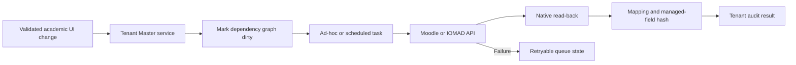

# Tenant Master CRUD And Integration Validation

## Scope

This validation covers `local_tenantmaster` release 1.2.0 on IOMAD 5.1.5.
Tenant Master metadata remains tenant-scoped while operational records are
projected through supported Moodle and IOMAD APIs. The plugin does not patch
IOMAD core or write directly to native IOMAD tables.

## CRUD Contract

| Domain | Create and read | Update | Removal behavior | Native target |
|---|---|---|---|---|
| Institution metadata | Existing company link, type and regulatory identifiers | Plugin-owned metadata only | Deactivate or archive | Native company is read-only |
| Academic year | Tenant-bound stable identity | Dates, name, current state and status | Archive; current year is cleared | Category hierarchy root |
| Academic master | Type, stable keys, year and parent ownership | Managed descriptive fields and active state | Deactivate or archive | Category, course, certificate or policy metadata |
| Department | Native IOMAD CRUD or approved import | Native IOMAD CRUD | Native IOMAD policy | IOMAD department |
| User and role | Native IOMAD CRUD | Native IOMAD CRUD | Suspend, end or unassign in IOMAD | Moodle user and IOMAD company membership |
| Cohort and group | Native CRUD or placement automation | Native CRUD or placement reconciliation | Preserve learning history | Moodle cohort and group |
| Enrolment | Native IOMAD CRUD or placement automation | Native IOMAD CRUD | Native supported API | Native enrolment and role assignment |
| Course academic metadata | Created with subject projection | Locked read-back verified values | Cleared only when source no longer applies | Moodle course custom fields |

Stable tenant, academic-year, master, and department keys cannot be changed
after creation. Parent selection rejects cross-tenant references and hierarchy
cycles. Academic-year updates reject records owned by another tenant.

Hard delete is intentionally not exposed for companies, active courses, users,
enrolments, grades, submissions, completion, certificates, or academic
history. Operators archive, deactivate, hide, suspend, or end-date records so
native history remains recoverable.

## Automatic Processing



A native company edit is not projected back from Tenant Master. A new academic
change resets exhausted retry attempts, repeated changes are debounced,
and workers lock by tenant and module. Projection failures remain retryable
without creating duplicate native records.

## Verified Native State

The sanitized School and University tenants were validated against the live
PostgreSQL database after scheduled processing:

| Measure | Result |
|---|---:|
| Tenants and mapped IOMAD companies | 2 |
| Academic years | 2 |
| Tenant-scoped masters | 90 |
| Active role mappings | 14 |
| Native projection mappings | 181 |
| Category mappings | 49 |
| Course mappings | 30 |
| Certificate mappings | 100 |
| Dirty records not synchronized | 0 |
| Mappings not synchronized | 0 |
| Open drift | 0 |
| Blocking validation findings | 0 |

Seven direct cross-tenant integrity checks returned zero anomalies for master
parents, academic years, master mappings, company mappings, department
mappings, course mappings, and stable-key ownership.

## Role And Route Validation

- A School Principal can open the School Tenant Master dashboard.
- Supplying the University company ID while impersonating the School Principal
  resolves back to the authorized School company and does not reveal
  University data.
- A Student cannot open Tenant Master administration.
- Anonymous requests redirect to the standard login page.
- Tenant Master's reduced academic navigation and contextual native IOMAD links
  are covered by authenticated browser smoke checks.
- Routes returned no PHP exception page, browser page error, console error, or
  document-level horizontal overflow.

## Repeatable Commands

```bash
make test
./scripts/test-phpunit.sh \
  public/local/tenantmaster/tests/crud_integration_test.php \
  public/local/tenantmaster/tests/lifecycle_test.php
docker compose exec -T iomad php admin/cli/check_database_schema.php
docker compose exec -T iomad php \
  public/local/tenantmaster/cli/verify_mdm_ecosystem.php \
  --format=json \
  --floci-url=http://host.docker.internal:4566 \
  --fail-on-warning
```

The ecosystem verifier must report 94 passing checks with no warnings or
failures. Release validation also runs the complete Tenant Master PHPUnit
suite, Moodle upgrade, cache purge, scheduled tasks, health checks, immutable
image build, and recovery-set verification.

## Boundaries

Policy expressions and relationship rules without a complete native IOMAD
equivalent remain versioned Tenant Master metadata; they are not presented as
native platform records. Real production identity, payment, AI, mail, DNS,
WordPress, and cloud-provider credentials are deployment inputs and are not
enabled by the sanitized demo tenants.
