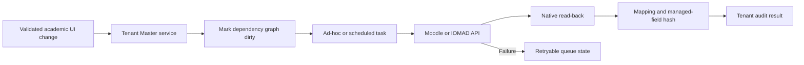

# Tenant Master CRUD And Integration Validation

## Scope

This validation covers `local_tenantmaster` release 1.4.0 on IOMAD 5.1.5.
Tenant Master metadata remains tenant-scoped while operational records are
projected through supported Moodle and IOMAD APIs. The plugin does not patch
IOMAD core or write directly to native IOMAD tables.

## CRUD Contract

| Domain | Create and read | Update | Removal behavior | Native target |
|---|---|---|---|---|
| Global master catalogue | System-level Shared and institution-type templates before company creation | Versioned managed fields with background propagation | Deactivate; no hard delete | Copied to applicable tenant masters, then projected normally |
| Institution metadata | Existing company link, type and regulatory identifiers | Plugin-owned metadata only | Deactivate or archive | Native company is read-only |
| Academic year | Tenant-bound stable identity | Dates, name, current state and status | Archive; current year is cleared | Category hierarchy root |
| Academic master | Type, stable keys, year and parent ownership | Managed descriptive fields and active state | Deactivate or archive | Category, course, certificate or policy metadata |
| Department | Native IOMAD CRUD or approved import | Native IOMAD CRUD | Native IOMAD policy | IOMAD department |
| User and role | Native IOMAD CRUD | Native IOMAD CRUD | Suspend, end or unassign in IOMAD | Moodle user and IOMAD company membership |
| Cohort and group | Native CRUD or placement automation | Native CRUD or placement reconciliation | Preserve learning history | Moodle cohort and group |
| Enrolment | Native IOMAD CRUD or placement automation | Native IOMAD CRUD | Native supported API | Native enrolment and role assignment |
| Course academic metadata | Created with subject projection | Locked read-back verified values | Cleared only when source no longer applies | Moodle course custom fields |

Stable tenant, academic-year, master, and department keys cannot be changed
after creation. Parent selection rejects cross-tenant references and hierarchy
cycles. Academic-year updates reject records owned by another tenant.

Hard delete is intentionally not exposed for companies, active courses, users,
enrolments, grades, submissions, completion, certificates, or academic
history. Operators archive, deactivate, hide, suspend, or end-date records so
native history remains recoverable.

## Automatic Processing



A native company edit is not projected back from Tenant Master. A new academic
change resets exhausted retry attempts, repeated changes are debounced,
and workers lock by tenant and module. Projection failures remain retryable
without creating duplicate native records.

Global catalogue changes use a separate background inheritance task. Missing or
unchanged inherited tenant records are created or updated and then enter this
same native projection pipeline. Tenant-customised records are reported as
conflicts and are never silently overwritten.

## Verified Native State

On 26 July 2026, the local database and dataroot were erased after creating and
verifying a recovery set. Clean IOMAD defaults were confirmed with zero
companies, company memberships, company courses, and departments. The
sanitized packs were then applied from source:

| Tenant | Company | Users | Learners | Courses | Departments | Categories | Cohorts | Groups | Enrolments |
|---|---|---:|---:|---:|---:|---:|---:|---:|---:|
| School | `GV_SCHOOL` | 219 | 100 | 56 | 12 | 52 | 12 | 37 | 666 |
| University | `NBU_ENGINEERING` | 174 | 100 | 46 | 11 | 54 | 8 | 33 | 741 |

The strict cross-company audit reported zero anomalies across course
enrolments, grades, groups, licences, company roles, user departments, and
course departments. The fixture suite also verifies:

- native company, department, user and course records remain tenant-scoped;
- master records project to supported native targets without duplicate mappings;
- cross-tenant parent, mapping and stable-key references are rejected;
- completed queue work leaves no dirty or failed fixture records;
- validation and drift reports contain no blocking fixture findings.

## Role And Route Validation

- A School Principal can open the School Tenant Master dashboard.
- Supplying the University company ID while impersonating the School Principal
  resolves back to the authorized School company and does not reveal
  University data.
- A Student cannot open Tenant Master administration.
- Anonymous requests redirect to the standard login page.
- Tenant Master's reduced academic navigation and contextual native IOMAD links
  are covered by authenticated browser smoke checks.
- Routes returned no PHP exception page, browser page error, console error, or
  document-level horizontal overflow.
- All 31 applicable School and University routes passed at 1440 px desktop and
  390 px mobile widths.
- Populated tables provide client-side row filtering and sortable non-action
  columns. Course and user screens retain their server-side tenant filters.

## CRUD Read-Back Drill

The live School tenant was used for a non-destructive update and restoration:

1. Edited the `SUBJECT_ENGLISH` master through the Tenant Master form.
2. Confirmed the background queue completed without failed work.
3. Read the changed name from native course `SCH_DEMO_ENGLISH`.
4. Confirmed mapping `TM:SCH_DEMO:SUBJECT:SUBJECT_ENGLISH` remained `synced`.
5. Restored the original source value and confirmed native read-back returned
   to `English`.
6. Edited and restored academic year `AY_2026_2027`.

This drill exposed and fixed the edit-form handling for immutable identifiers.
Master, academic-year, and class-placement edit forms now preserve trusted
server-side identity while allowing managed fields to be updated.

## Pre-Company Catalogue Validation

The global Master catalogue is available before an IOMAD company or managed
Tenant Master profile exists. The validated control surface provides five scope
tiles (Shared, School, University, College and Training) and 15 master-type
tiles, including boards, mediums, grades, streams, subjects, programmes and
semesters.

The live browser drill validated the following:

- a fresh session can open the Tenant Master setup dashboard and Master
  catalogue without selecting a company;
- Site administration lists **Master catalogue** as a distinct secured page
  inside **Tenant Master**;
- IOMAD Admin Tools presents separate **Tenant Master**, **Master catalogue**
  and **Tenant course editor** tiles after normal capability filtering;
- create, read, update, activate and deactivate controls are protected by the
  system-level `local/tenantmaster:managecatalogue` capability;
- stable identifiers and scope cannot be changed after creation;
- catalogue tables support filtering and sortable columns;
- desktop at 1440 px and mobile at 390 px have no document overflow, PHP error
  page or browser console error;
- administrator tiles use the reviewed institution, workflow and course SVG
  symbols rather than generic icon fallbacks;
- editing and restoring `BOARD_CBSE` completed its background propagation job;
- the existing school tenant's independently changed board value was classified
  as a conflict and was not overwritten.

New tenants copy only the active Shared and matching tenant-type catalogue
records. Later catalogue changes automatically create missing inherited records
and update records that still match their inherited hash. Customized tenant
records remain unchanged and appear as conflicts for administrator review.

## Repeatable Commands

```bash
make test
./scripts/test-phpunit.sh \
  public/local/tenantmaster/tests/crud_integration_test.php \
  public/local/tenantmaster/tests/lifecycle_test.php
docker compose exec -T iomad php admin/cli/check_database_schema.php
docker compose exec -T iomad php \
  public/local/tenantmaster/cli/verify_mdm_ecosystem.php \
  --company=GV_SCHOOL,NBU_ENGINEERING \
  --format=json \
  --fail-on-warning
```

The original two-tenant fixture run returned 94 pass, 0 warning, and 0 failure.
The current clean-site verification returned 60 pass, 7 fixture-data warnings
and 0 failure; the warnings identify persona records that have not yet been
seeded, rather than application or isolation failures. The complete Tenant
Master PHPUnit selection returned 34 tests and 155 assertions. Release
validation also runs Moodle upgrade, cache purge, scheduled tasks, health
checks, immutable image build, and recovery-set verification. The verifier's
exact check count remains data-dependent and is not a release invariant.

## Boundaries

Policy expressions and relationship rules without a complete native IOMAD
equivalent remain versioned Tenant Master metadata; they are not presented as
native platform records. Real production identity, payment, AI, mail, DNS,
WordPress, and cloud-provider credentials are deployment inputs and are not
enabled by the sanitized demo tenants.
