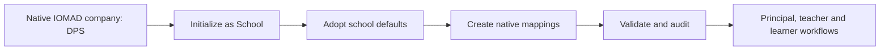

# DPS School Tenant Master Use Case

## Purpose

This guide describes the native-first setup and operating sequence for the
sanitized `DPS` IOMAD company. Tenant Master orchestrates school-specific
academic data while IOMAD and Moodle remain authoritative for operational
records.

## Ownership Boundary

| Domain | Authoritative system | Tenant Master responsibility |
|---|---|---|
| Trust and school identity | IOMAD company | Stable trust code and school profile extension |
| Campus and departments | IOMAD departments | Read, validate and coordinate mappings |
| Users and company membership | Moodle and IOMAD | Placement rules and role intent |
| Categories and courses | Moodle and IOMAD | Generate and reconcile the academic structure |
| Cohorts, groups and enrolments | Moodle and IOMAD | Calculate class placement and supported access |
| Board, medium, grade and stream | Tenant Master | Tenant-scoped academic masters |
| Division, subject and policies | Tenant Master | Tenant-scoped rules and projections |
| Grades, completion and certificates | Moodle and IOMAD | Validate policy and projection state |

Tenant Master never creates a second company for the same school.

## Initialization

1. Create or edit the company in native IOMAD.
2. Set a unique stable company code. DPS uses `DPS`.
3. Open **Site administration > Tenant Master > Tenants**.
4. Select **DPS [DPS]**.
5. Select **School** as the institution type.
6. Select **Initialise academic management**.
7. Confirm that **DPS [DPS]** appears in Active institution.

Initialization links the existing company, creates the Tenant Master profile,
installs the school role mappings and adopts the applicable school defaults.
It does not duplicate or overwrite the native company.



## School Setup Sequence

### 1. Institution Profile

Open **Institution master data**.

- Maintain the company name, hostname, logo, domain and branding in IOMAD.
- Maintain the trust code, institution type and regulatory metadata in Tenant
  Master.
- Keep the trust and school as one company unless a school is independently
  administered and requires a child company.

### 2. Organisation

Open **Organisation**.

- Create the school, campus and administrative units as native IOMAD
  departments.
- Use child departments for academic departments or campuses.
- Do not use departments as course categories.
- Assign the Principal at company scope and HODs at department scope.

### 3. Academic Year

Open **Academic structure** and create one current academic year.

Example:

| Field | Value |
|---|---|
| Code | `AY-2026-2027` |
| Name | `Academic Year 2026-2027` |
| Start | School opening date |
| End | School closing date |
| Current | Yes |

Only one academic year should be current for a tenant.

### 4. Academic Masters

Review and modify the adopted masters:

- board;
- medium;
- Nursery through Grade 12;
- streams;
- divisions;
- subjects;
- assessment policy;
- attendance policy;
- certificate rule;
- progression rule.

Use stable codes for every record. Names may change; stable codes must not.
Use the bulk package interface for reviewed multi-record changes.

### 5. Course Projection

Open **Academic course projections**.

The expected hierarchy is:

```text
Academic year
  Board
    Medium
      Grade
        Stream
          Subject course
```

Tenant Master projects supported masters through Moodle and IOMAD APIs. The
result remains a native Moodle category or course and is visible in normal
course administration.

### 6. Users And Roles

Open **Users and roles**.

| School role | Native operational mapping |
|---|---|
| Principal | IOMAD company manager |
| Trustee or management | Reporting or parent-company manager |
| IT coordinator | Limited company administrator |
| Teacher | Company educator and course teacher |
| Student | Company user and course participant |
| Parent or guardian | Mentor role with explicit learner relationship |
| HOD | Department manager with scoped reporting |

Create users and company memberships through native IOMAD. Do not grant site
administrator to school roles.

### 7. Classes, Divisions And Access

Open **Classes and placements** and **Cohorts and enrolments**.

- Use a year-scoped cohort for a class or batch.
- Use a native course group for a division or section.
- Use cohort synchronization for bulk class access.
- Use manual or configured IOMAD licence enrolment for exceptions.
- Assign teachers to subject courses with the native teacher role.
- Link parents to learners explicitly; do not infer parent access by surname or
  contact details.

Example:

```text
Cohort: DPS-2026-G08-A
Grade: 8
Stream: General
Division: A
Subject course: DPS-2026-G08-MATH
Course group: Division A
```

### 8. Assessment And Certificates

Open **Assessments** and **Certificates**.

- Apply assessment policy to native Moodle gradebooks.
- Keep activity grades, attempts and completion in Moodle.
- Apply attendance policy through the configured attendance implementation.
- Project certificate rules through the installed IOMAD certificate APIs.
- Never delete historic grades, completion or issued certificates during
  reconciliation.

### 9. Synchronization And Validation

Open **Synchronization**.

- Review pending and failed work.
- Retry failed items after correcting their source records.
- Resolve drift explicitly instead of silently overwriting native changes.

Open **Validation** and run **Validate all** before onboarding learners or
performing annual rollover.

Acceptance requires:

- no blocking issues;
- no cross-company references;
- no failed synchronization items;
- no duplicate stable keys;
- native target read-back matching managed fields.

## Role Workflows

### Principal

1. Select DPS as the active institution.
2. Review company users, departments and courses.
3. Approve the academic year and school masters.
4. Review validation and synchronization.
5. Use tenant-scoped reports; no site-administrator access is required.

### Teacher

1. Receive native DPS company membership.
2. Receive educator status and course teacher assignment.
3. Access only assigned subject courses and divisions.
4. Manage activities, grades, feedback and completion through Moodle.
5. Review progress without access to another company.

### Student

1. Receive native DPS company membership.
2. Enter a year-scoped class cohort and division group.
3. Receive subject-course access through supported enrolment.
4. Complete Moodle activities, assessments and certificates.
5. Retain history when progressing to the next year.

### Parent Or Guardian

1. Receive the mentor role.
2. Receive an explicit relationship to one or more learners.
3. View only permitted learner progress and reports.
4. Receive no general company-manager or course-editing capability.

## Academic-Year Rollover

1. Back up the database and dataroot.
2. Create the next academic year.
3. Copy or adopt the next-year academic structure.
4. Run the rollover preview.
5. Review retained, promoted, graduated and exception learners.
6. Apply the approved rollover.
7. Create new year-scoped cohorts and groups.
8. Reconcile course access.
9. Preserve previous courses, enrolments, grades, completion and certificates.
10. Run synchronization and validation again.

Courses may be copied for the new year when content must be frozen by cohort.
Evergreen courses may be reused only when reporting, enrolment and content
version requirements permit it.

## Current Sanitized DPS Baseline

After initialization, the local DPS tenant was verified with:

| Measure | Result |
|---|---:|
| Academic masters | 51 |
| Role mappings | 7 |
| Category mappings | 30 |
| Course mappings | 18 |
| Certificate mappings | 18 |
| Pending synchronization work | 0 |
| Blocking validation issues | 0 |

These counts describe the current sanitized local state and will change as
administrators modify the school.
