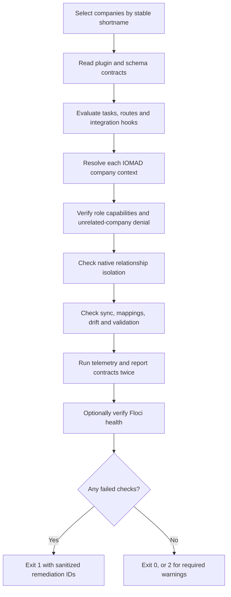

# Tenant Master Ecosystem Verification

`local_tenantmaster` includes a read-only acceptance verifier for developers,
QA, release automation, and incident diagnosis. Normal tenant operation remains
fully available in the plugin UI and does not depend on this command.

## Run

Verify the seeded School and University tenants:

```bash
make ecosystem-verify VERIFY_ARGS="--company=GV_SCHOOL,NBU_ENGINEERING --format=table --max-report-ms=5000"
```

Include the optional Floci API health contract:

```bash
make ecosystem-verify VERIFY_ARGS="--company=GV_SCHOOL,NBU_ENGINEERING --format=json --max-report-ms=5000 --floci-url=http://host.docker.internal:4566/_floci/health"
```

Use `--fail-on-warning` in CI when optional checks are required. Exit status is
`0` for green, `1` for a failed check, and `2` when warnings exist with
`--fail-on-warning`.

## Coverage

The verifier checks:

- required project plugin versions, XMLDB tables, indexes, scheduled tasks,
  delayed tasks, and failed ad-hoc tasks;
- IOMAD company identity, departments, users, role mappings, manager types,
  guardian consolidation, courses, cohorts, groups, and enrolments;
- Principal, Trustee, IT coordinator, HOD/Dean, Teacher, Student, and Guardian
  capabilities in their real company, department, course, and user contexts;
- denial of unrelated-company access and absence of cross-company user,
  course, department, cohort, group, enrolment, and gamification leakage;
- synchronization queues, projection mappings, managed-field drift, blocking
  validation issues, import state, and task recovery state;
- SCORM offline completion, H5P event wiring, gamification aggregates, and
  duplicate-event idempotency;
- every built-in tenant report, repeatability, execution budget, tenant
  scoping, and learner pseudonymization when PII capability is absent;
- application routes and all Tenant Master navigation sections;
- optional Floci API connectivity.

The output contains aggregate counts, role shortnames, company shortnames,
check identifiers, statuses, durations, and sanitized remediation identifiers.
It does not print names, email addresses, passwords, access tokens, database
credentials, raw learner IDs, or the analytics pseudonym key.

## Execution Flow



## Safety

The verifier never repairs data, changes capabilities, edits native tables, or
generates executable hotfixes. Fixes must be implemented through reviewed
Moodle/IOMAD APIs, plugin upgrade steps, and regression tests. After a fix,
rebuild the immutable image and rerun this verifier, `make demo-verify`, the
deep IOMAD monitor, and the backup/restore drill.

For continuous operation, use the Tenant Master Dashboard, Synchronization,
Validation, Drift, and Audit pages. For recovery procedures, see
[Operations and recovery](operations.md).
