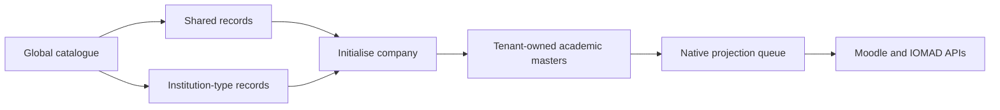

# Master Catalogue

## Purpose

The **Master catalogue** is the system-level source for reusable academic
templates before any IOMAD company is created or initialised. It contains
separate Shared, School, University, College and Training scopes.

Use the catalogue for boards, media, grades, streams, divisions, subjects,
programmes, semesters, specialisations, credits, course templates and policy
defaults. Company identity, departments, users, courses and enrolments remain
native IOMAD or Moodle records.

## UI Workflow

1. Sign in as a site administrator.
2. Open **Site administration > Tenant Master > Master catalogue**.
   The same system-level page is available as the separate **Master
   catalogue** tile under **IOMAD Admin Tools > Company**.
3. Select a scope tile.
4. Select a master-type tile.
5. Add or edit the record.
6. Keep the external ID and code stable after creation.
7. Use **Deactivate** instead of deleting a record.
8. Review the Propagation column.

The table supports local filtering, sorting, editing and active-state actions.
Configuration JSON must be a JSON object and must not contain credentials or
personal data.

## Initialisation

When an existing IOMAD company is initialised, Tenant Master copies the active
Shared records plus the records for its institution type. Each tenant copy
stores its catalogue item ID, catalogue version and inherited managed-field
hash. The native company is not duplicated.

## Change Propagation

A catalogue save queues a debounced background task. For each applicable
initialised tenant:

- a missing tenant master is created and queued for native projection;
- an unchanged inherited master is updated and queued;
- a tenant master already equal to the latest catalogue is relinked without
  duplicate projection;
- a tenant-customised master is reported as a conflict and is not overwritten.

Propagation status is **Queued**, **Running**, **Complete** or **Failed**. The
result records created, updated, unchanged and conflict counts. Tenant-level
changes continue through the normal dirty queue, supported APIs, native
read-back, mapping and audit pipeline.

Deactivation follows the same rules. It is not a hard delete and does not
delete native courses, enrolments, grades, completion, certificates or
history.

## Permissions

`local/tenantmaster:managecatalogue` is a system-context capability. Site
administrators have access automatically. It must not be granted to ordinary
company managers because catalogue changes may affect multiple tenants.
