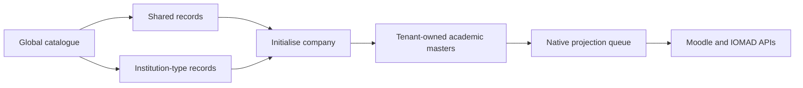

# Global Master Templates

## Purpose

**Global master templates** is the optional system-level source for reusable academic
templates before any IOMAD company is created or initialised. It contains
separate Shared, School, University, College and Training scopes.

Use the catalogue for boards, media, grades, streams, divisions, subjects,
programmes, semesters, specialisations, credits, course templates and policy
defaults. Company identity, departments, users, courses and enrolments remain
native IOMAD or Moodle records.

## UI Workflow

1. Sign in as a site administrator.
2. Open **Site administration > Tenant Master > Global master templates**.
   It is intentionally absent from company Admin Tools because it can affect
   multiple tenants.
3. Select a scope tile.
4. Select a master-type tile.
5. Add or edit the record.
6. Keep the external ID and code stable after creation.
7. Use **Deactivate** when the template may be needed again but should not be
   copied to new tenants.
8. Use the delete icon to preview and confirm a reversible catalogue removal.
9. Review the Propagation column.

The table supports local filtering, sorting, editing, active-state actions and
guarded removal. **Show removed items** displays audit tombstones and provides
**Restore and synchronize**. Configuration JSON must be a JSON object and must
not contain credentials or personal data.

After initialisation, edit a company-specific grade, stream, division or
subject from the matching tile in **IOMAD Admin Tools > Tenants**. Such changes
belong only to the selected tenant and never modify these global templates or
another tenant.

## Initialisation

When an existing IOMAD company is initialised, Tenant Master copies the active
Shared records plus the records for its institution type. Each tenant copy
stores its catalogue item ID, catalogue version and inherited managed-field
hash. The native company is not duplicated.

## Change Propagation

A catalogue save queues a debounced background task. For each applicable
initialised tenant:

- a missing tenant master is created and queued for native projection;
- an unchanged inherited master is updated and queued;
- a tenant master already equal to the latest catalogue is relinked without
  duplicate projection;
- a tenant-customised master is reported as a conflict and is not overwritten.

Propagation status is **Queued**, **Running**, **Complete** or **Failed**. The
result records created, updated, unchanged and conflict counts. Tenant-level
changes continue through the normal dirty queue, supported APIs, native
read-back, mapping and audit pipeline.

Deactivation follows the same rules. It is not a hard delete and does not
delete native courses, enrolments, grades, completion, certificates or
history.

## Removal And Restoration

Catalogue deletion is a reversible soft removal:

1. Tenant Master calculates dependent child templates, linked tenants and
   tenant-customized conflicts.
2. Active child templates block removal. Remove or re-parent those children
   first.
3. Confirmation records the item as removed and queues propagation.
4. Unchanged inherited tenant masters are deactivated and enter the normal
   native synchronization pipeline.
5. Tenant-customized masters remain unchanged and are reported as conflicts.
6. Tenants that never inherited the item do not receive a new inactive record.
7. **Show removed items > Restore and synchronize** clears the tombstone,
   restores the item’s previous active state and queues propagation again.

Removed built-in defaults are not silently recreated during catalogue seeding.
The tombstone preserves the stable key, version, actor and time for audit.
Removal never deletes a native company, department, category, course, user,
enrolment, grade, submission, completion, certificate or academic-history
record.

## Permissions

`local/tenantmaster:managecatalogue` is a system-context capability. Site
administrators have access automatically. It must not be granted to ordinary
company managers because catalogue changes may affect multiple tenants.
