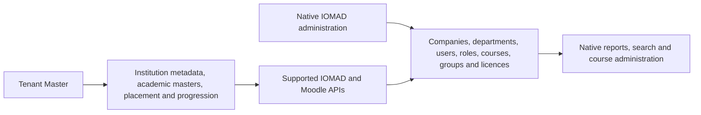

# Native-First Administration

## Decision

IOMAD and Moodle are the only manual CRUD surfaces for records they already
support. Tenant Master adds academic orchestration only where there is no
complete native model.

Tenant Master does not create a second company, user, department, cohort,
group, enrolment, or role record. Automation and approved imports may call the
same supported native APIs, but operators edit those records in IOMAD.

## Ownership Matrix

| Record | Manual administration | Tenant Master responsibility |
|---|---|---|
| Company, parent company, domain and branding | IOMAD Dashboard | Link by native company code; never overwrite |
| Campus and organisational department | IOMAD Departments | Reference native IDs in academic automation |
| User and company membership | IOMAD Users | Select existing company members for placement |
| Company manager and department manager | IOMAD Managers | Maintain semantic role defaults used by automation |
| User custom fields | IOMAD User profiles | No duplicate user profile storage |
| Course shell and company-course settings | IOMAD Courses | Generate approved subject/template projections |
| Cohort, group, enrolment and licence | IOMAD Courses/Groups/Licences | Reconcile class placement through native APIs |
| Company code | IOMAD Company | Stable one-to-one `trustcode` link |
| Institution type and regulatory identifiers | Tenant Master | Versioned institution metadata |
| Academic year, board, medium, grade, stream, division, subject | Tenant Master | Academic semantics and native projection |
| Placement, progression, rollover and policy | Tenant Master | Reviewed orchestration and audit |

## First-Time Sequence

1. Open **IOMAD Dashboard > Company > Create company**.
2. Set a unique permanent company code. Tenant Master will use the exact value
   as its stable company link.
3. Configure the company profile, hostname, theme, logo, colours and email
   settings in IOMAD.
4. Create campuses and departments in **IOMAD > Manage departments**.
5. Create users, memberships and managers in the IOMAD user screens.
6. Open **Tenant Master > Managed institutions**.
7. Select the existing company, choose the institution type and click
   **Initialise academic management**.
8. Complete institution regulatory metadata and academic masters in Tenant
   Master.

Initialisation is idempotent and never creates or edits the native company.
Changing the native company code after initialisation is unsupported because
it is a stable external identifier.

## Native Course Custom Fields

Tenant Master declares locked Moodle course custom fields in the native
**Course custom fields** framework:

| Shortname | Value |
|---|---|
| `tm_company_code` | Native IOMAD company code |
| `tm_institution_type` | School, university, college or training |
| `tm_academic_year` | Academic-year code |
| `tm_board`, `tm_medium`, `tm_grade`, `tm_stream` | School hierarchy codes |
| `tm_programme`, `tm_semester`, `tm_specialisation` | Higher-education hierarchy codes |
| `tm_subject` | Subject code |
| `tm_credit_value` | Credit value from course master metadata |
| `tm_source_external_id` | Immutable Tenant Master source key |

The fields are teacher-visible, locked against ordinary course editing and
searchable in IOMAD course management. Projection uses the core custom-field
API and verifies every saved value by read-back.

## Navigation

Tenant Master intentionally contains only:

- **Dashboard**
- **Managed institutions** for site administrators
- **Institution master data**
- **Academic masters**
- **Academic course projections**
- **Classes and placements** for school tenants
- **Progression**
- **Imports**
- **Synchronization**
- **Validation**
- **Audit**

Each relevant page includes capability-filtered links to the selected
company's native IOMAD dashboard, company, department, user, course, group and
licence screens. Old Tenant Master `organisation`, `people`, and `access`
bookmarks redirect to native IOMAD administration.

## Upgrade Behavior

Plugin release `1.2.0` removes legacy copies of native company name, address,
location, hostname, branding colours and custom CSS from Tenant Master
`profilejson`. Native IOMAD values are not changed. Existing operational
records and mappings remain intact.

Rollback must restore the matching database, dataroot and immutable image.
Do not downgrade the database or reinstall deleted duplicate forms.
