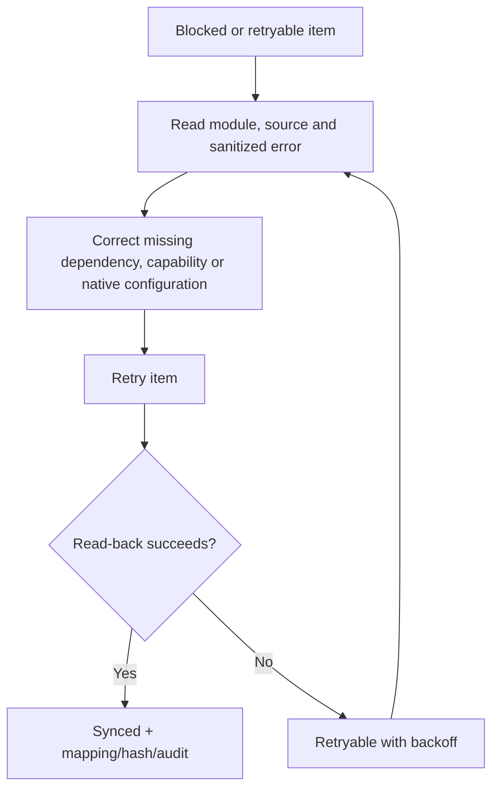

# Tenant Master Operations

## Scheduled Work

| Task | Schedule | Purpose |
|---|---|---|
| Process dirty records | Every minute | Recover work not completed by ad-hoc tasks |
| Detect drift | Daily 02:23 | Compare managed native fields |
| Validate tenants | Daily 03:47 | Refresh structured isolation/configuration issues |

The repository cron container runs Moodle’s task scheduler. Tenant Master does
not require a separate CLI process.

## Daily Checks

1. Dashboard pending work is zero.
2. Synchronization has no blocked items.
3. Validation has no blocking issues.
4. Drift has no unresolved unexpected changes.
5. Cron and application health checks are healthy.
6. Audit shows expected actor/action/result records.

## Failure Recovery

Do not edit queue, mapping, or native database tables. Use Retry, Sync All, or
one of the explicit drift resolutions.

## Backup And Restore

Tenant Master metadata and native projections must be recovered together.
Follow [Backup and restore](../backup-restore.md):

1. Stop cron and enable maintenance mode.
2. Capture PostgreSQL and `iomaddata` as one recovery set.
3. Record exact image and pinned IOMAD commit.
4. Verify manifest and checksums.
5. Restore database, dataroot, and matching immutable image together.
6. Run schema upgrade only in the forward direction.
7. Purge caches, restart cron, smoke-test tenant hostnames, run Tenant Master
   validation, and check drift.

Never roll back an image after schema migration without restoring its matching
database and dataroot. A database downgrade is unsupported.

## Upgrade Gate

Before changing IOMAD:

- keep automatic synchronization enabled until pending work is zero;
- run validation and drift detection;
- take and verify a recovery set;
- stop cron and enter maintenance mode;
- run adapter/API compatibility tests against the reviewed candidate commit;
- perform clean-install and previous-version upgrade tests;
- deploy the immutable image and run `admin/cli/upgrade.php` once;
- purge caches and smoke-test both demo tenant models.

The platform upgrade automation may use CLI. Everyday Tenant Master operation
does not.

## Audit And Privacy

Audit detail recursively redacts password, token, secret, key, email, name,
phone, and address keys. Import reports must not contain credentials or full
identity rows. Access to validation/audit requires tenant-scoped capability.
Retention and privacy requests follow the plugin privacy provider and the
repository security policy.
