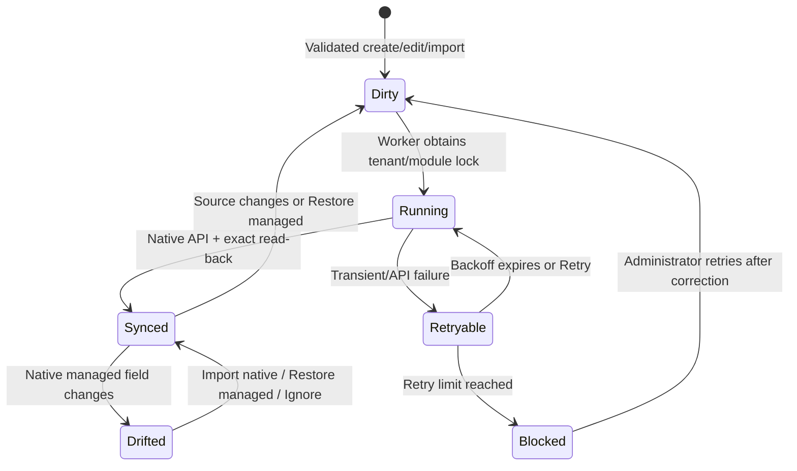

# Synchronization And Drift

## State Machine

`local_tenantmaster_dirty` has a unique tenant/module/source key. Repeated edits
replace the reason and reset the same work item instead of generating duplicate
jobs.

## Processing

- Each source service commits first and then marks dependent modules dirty.
- Ad-hoc tasks are queued two seconds later to debounce repeated form saves.
- A scheduled worker scans available dirty/retryable work every minute.
- A Moodle lock protects each tenant/module execution.
- Work is processed in deterministic source order with a configurable limit.
- A successful adapter call is read back before the mapping is marked synced.
- A failed item stores a sanitized error class/message and exponential backoff.
- The job closes as `completed_with_errors`; it does not crash or conceal the
  retryable item.

`Sync All` requeues the real dependency graph: tenant, academic years, category
masters, course masters, and every company course’s assessment, attendance,
and certificate configuration.

## Managed Fields And Drift

The mapping stores:

- native component and target ID;
- stable external key;
- fields managed by Tenant Master;
- last desired/native hashes;
- last synchronized time and status.

The nightly drift task compares only managed fields and classifies findings:

- `platform_only`: native managed value changed;
- `conflict`: native changed while the master has pending work;
- `missing_native`: mapped native object no longer exists.

Resolution is never automatic:

1. **Import from IOMAD** accepts current managed fields as the new baseline.
2. **Restore managed** requeues or calls the supported native update API.
3. **Ignore** records an explicit operator decision.

Unmanaged native fields remain untouched.

## Pause And Resume

Disable **Automatic synchronization** only during a controlled incident or
upgrade. New work remains dirty. After correction:

1. Re-enable automatic synchronization.
2. Open **Synchronization** and review failed/blocked items.
3. Use **Retry** for corrected items or **Sync All** for reconciliation.
4. Wait for pending work to reach zero.
5. Run **Validation** and inspect **Audit**.

Do not clear queue rows manually.
